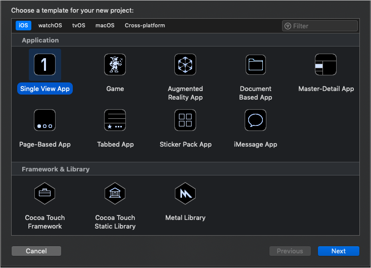
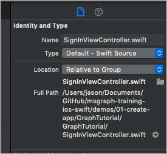
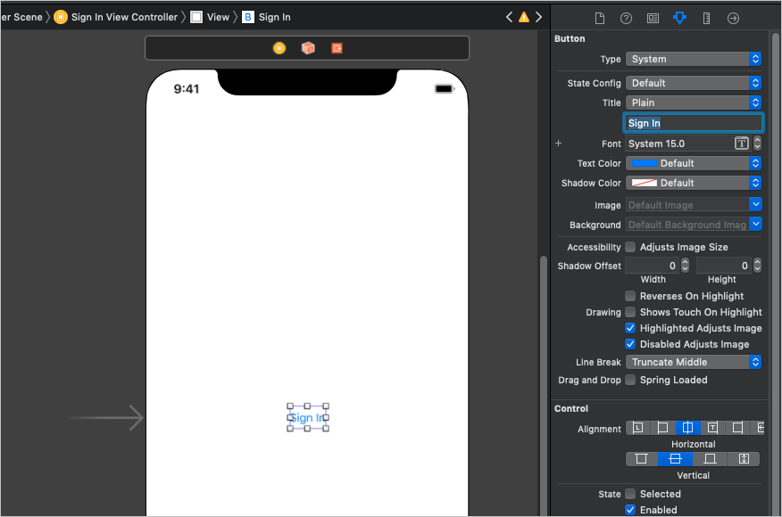

<!-- markdownlint-disable MD002 MD041 -->

最初に、新しい Swift プロジェクトを作成します。

1. Xcode を開きます。 [**ファイル**] メニューの [**新規作成**]、[**プロジェクト**] の順に選択します。
1. [**単一ビューアプリ**] テンプレートを選択し、[**次へ**] を選択します。

    

1. **製品名** `GraphTutorial`と**言語**を**Swift**に設定します。
1. 残りのフィールドに入力し、[**次へ**] を選択します。
1. プロジェクトの場所を選択して、[**作成**] を選択します。

## <a name="install-dependencies"></a>依存関係のインストール

に進む前に、後で使用する追加の依存関係をインストールします。

- Azure AD での認証については、 [Microsoft Authentication Library (MSAL) For iOS](https://github.com/AzureAD/microsoft-authentication-library-for-objc)を使用してください。
- Microsoft graph に電話をかけるための[Microsoft GRAPH SDK For 客観 C](https://github.com/microsoftgraph/msgraph-sdk-objc) 。
- Microsoft Graph では、ユーザーやイベントなどの Microsoft Graph のリソースを表す、厳密に型指定されたオブジェクト用の[Microsoft Graph モデル SDK を目的](https://github.com/microsoftgraph/msgraph-sdk-objc-models)としています。

1. Xcode を終了します。
1. ターミナルを開き、グラフのディレクトリを**Graphtutorial**プロジェクトの場所に変更します。
1. Podfile を作成するには、次のコマンドを実行します。

    ```Shell
    pod init
    ```

1. Podfile を開き、行の`use_frameworks!`直後に次の行を追加します。

    ```Ruby
    pod 'MSAL', '~> 1.0.2'
    pod 'MSGraphClientSDK', ' ~> 1.0.0'
    pod 'MSGraphClientModels', '~> 1.3.0'
    ```

1. Podfile を保存してから、次のコマンドを実行して依存関係をインストールします。

    ```Shell
    pod install
    ```

1. コマンドが完了したら、Xcode で新しく作成した**graphtutorial**を開きます。

## <a name="design-the-app"></a>アプリを設計する

このセクションでは、アプリのビュー (サインインページ、タブバーナビゲーター、ウェルカムページ、予定表ページ) を作成します。 また、アクティビティインジケーターオーバーレイも作成します。

### <a name="create-sign-in-page"></a>サインインページの作成

1. Xcode の**Graphtutorial**フォルダーを展開し、[ **viewcontroller. swift**] を選択します。
1. **ファイルインスペクター**で、ファイルの**名前**をに`SignInViewController.swift`変更します。

    

1. **SignInViewController**を開き、そのコンテンツを次のコードに置き換えます。

    ```Swift
    import UIKit

    class SignInViewController: UIViewController {

        override func viewDidLoad() {
            super.viewDidLoad()
            // Do any additional setup after loading the view.
        }

        @IBAction func signIn() {
            self.performSegue(withIdentifier: "userSignedIn", sender: nil)
        }
    }
    ```

1. メインの**ストーリーボード**ファイルを開きます。
1. [**ビューコントローラーシーン**] を展開し、[**ビューコントローラー**] を選択します。

    

1. [ **Identity Inspector**] を選択してから、**クラス**のドロップダウンを**SignInViewController**に変更します。

    

1. **ライブラリ**を選択し、**ボタン**を [サインイン]**ビューコントローラー**にドラッグします。

    

1. ボタンを選択した状態で、[ **Attributes Inspector** ] **** を選択し、ボタン`Sign In`のタイトルをに変更します。

    

1. **サインインビューコントローラー**を選択し、[**接続インスペクター**] を選択します。
1. [**受信した処理**] で、[**サインイン**] の隣にある円をボタンにドラッグします。 ポップアップメニューで [ **Touch Up** ] を選択します。

    

1. [**エディター** ] メニューの [**自動レイアウトの問題を解決**する] を選択し、[すべてのビューの下**にある**[不足している**制約の追加**] を選択します。

### <a name="create-tab-bar"></a>タブバーを作成する

1. **ライブラリ**を選択し、**タブバーコントローラー**をストーリーボードにドラッグします。
1. **サインインビューコントローラー**を選択し、[**接続インスペクター**] を選択します。
1. [**トリガー**された Segues] で、[**手動**] の横にある円を、ストーリーボードの**タブバーコントローラー**にドラッグします。 ポップアップメニューの [**モーダル**] を選択します。

    

1. 追加した segue を選択し、[ **Attributes Inspector**] を選択します。 **識別子** `userSignedIn`フィールドをに設定し、**プレゼンテーション**を**全画面表示**に設定します。

    

1. **アイテム1のシーン**を選択し、[**接続インスペクター**] を選択します。
1. [**トリガー**された Segues] で、[**手動**] の横にある円を、ストーリーボードの**サインインビューコントローラー**にドラッグします。 ポップアップメニューの [**モーダル**] を選択します。
1. 追加した segue を選択し、[ **Attributes Inspector**] を選択します。 **識別子** `userSignedOut`フィールドをに設定し、**プレゼンテーション**を**全画面表示**に設定します。

### <a name="create-welcome-page"></a>ウェルカムページを作成する

1. [ **Assets] セット**ファイルを選択します。
1. [**エディター** ] メニューの [**アセットの追加**] を選択し、[**新しいイメージセット**] を選択します。
1. 新しい**画像**アセットを選択し、**属性インスペクター**を使用してその**名前**をに`DefaultUserPhoto`設定します。
1. 既定のユーザープロファイル写真として機能する任意のイメージを追加します。

    

1. という名前`WelcomeViewController`の**graphtutorial**フォルダーに、新しい**cocoa タッチクラス**ファイルを作成します。 Field**のサブクラス**で [ **uiviewcontroller** ] を選択します。
1. **WelcomeViewController**を開き、そのコンテンツを次のコードに置き換えます。

    ```Swift
    import UIKit

    class WelcomeViewController: UIViewController {

        @IBOutlet var userProfilePhoto: UIImageView!
        @IBOutlet var userDisplayName: UILabel!
        @IBOutlet var userEmail: UILabel!

        override func viewDidLoad() {
            super.viewDidLoad()

            // Do any additional setup after loading the view.

            // TEMPORARY
            self.userProfilePhoto.image = UIImage(imageLiteralResourceName: "DefaultUserPhoto")
            self.userDisplayName.text = "Default User"
            self.userEmail.text = "default@contoso.com"
        }

        @IBAction func signOut() {
            self.performSegue(withIdentifier: "userSignedOut", sender: nil)
        }
    }
    ```

1. **メインのストーリーボード**を開きます。 **アイテム1のシーン**を選択し、[ **id インスペクター**] を選択します。 **クラス**値を**WelcomeViewController**に変更します。
1. **ライブラリ**を使用して、次のアイテムを**アイテム1のシーン**に追加します。

    - 1つの**イメージビュー**
    - 2つの**ラベル**
    - 1つの**ボタン**

1. イメージビューを選択し、**サイズインスペクター**を選択します。
1. **幅**と**高さ**を196に設定します。
1. 2番目のラベルを選択し、[ **Attributes インスペクター**] を選択します。
1. **色**を**濃い灰色の色**に変更し、**フォント**を**システム 12.0**に変更します。
1. ボタンを選択し、[ **Attributes Inspector**] を選択します。
1. **タイトル**をに`Sign Out`変更します。
1. [**接続インスペクター**] を使用して、次の接続を行います。

    - **Userdisplayname**アウトレットを最初のラベルにリンクします。
    - **Useremail**アウトレットを2番目のラベルにリンクします。
    - **UserProfilePhoto**アウトレットをイメージビューにリンクします。
    - **SignOut** received アクションをボタンの**タッチアップ**にリンクします。

1. シーンの下部にあるタブバー項目を選択し、[ **Attributes Inspector**] を選択します。 **タイトル**をに`Me`変更します。
1. [**エディター** ] メニューの [**自動レイアウトの問題を解決**する] を選択し、[**ウェルカムビューコントローラーのすべてのビューの**下にある [不足している制約を**追加**する] を選択します。

完了したら、開始シーンは次のようになります。


### <a name="create-calendar-page"></a>予定表ページを作成する

1. という名前`CalendarViewController`の**graphtutorial**フォルダーに、新しい**cocoa タッチクラス**ファイルを作成します。 Field**のサブクラス**で [ **uiviewcontroller** ] を選択します。
1. **Calendarviewcontroller**を開き、その内容を次のコードで置き換えます。

    ```Swift
    import UIKit

    class CalendarViewController: UIViewController {

        @IBOutlet var calendarJSON: UITextView!

        override func viewDidLoad() {
            super.viewDidLoad()

            // Do any additional setup after loading the view.

            // TEMPORARY
            calendarJSON.text = "Calendar"
            calendarJSON.sizeToFit()
        }
    }
    ```

1. **メインのストーリーボード**を開きます。 **アイテム2のシーン**を選択し、[ **id インスペクター**] を選択します。 **クラス**値を**calendarviewcontroller**に変更します。
1. **ライブラリ**を使用して、**アイテム2のシーン**に**テキストビュー**を追加します。
1. 追加したテキストビューを選択します。 **エディター**で、[**埋め込み**] を選択してから、[ビュー] を**スクロール**します。
1. [**接続インスペクター**] を使用して、 **calendarjson**アウトレットをテキストビューに接続します。
1. 1. シーンの下部にあるタブバー項目を選択し、[ **Attributes Inspector**] を選択します。 **タイトル**をに`Calendar`変更します。
1. [**エディター** ] メニューの [**自動レイアウトの問題を解決**する] を選択し、[**ウェルカムビューコントローラーのすべてのビューの**下にある [不足している制約を**追加**する] を選択します。

完了すると、予定表のシーンは次のようになります。


### <a name="create-activity-indicator"></a>アクティビティインジケーターの作成

1. という名前`SpinnerViewController`の**graphtutorial**フォルダーに、新しい**cocoa タッチクラス**ファイルを作成します。 Field**のサブクラス**で [ **uiviewcontroller** ] を選択します。
1. **Spinnerviewcontroller**を開き、その内容を次のコードで置き換えます。

    ```Swift
    import UIKit

    class SpinnerViewController: UIViewController {

        var spinner = UIActivityIndicatorView(style: .whiteLarge)

        override func loadView() {
            view = UIView()
            view.backgroundColor = UIColor(white: 0, alpha: 0.7)

            spinner.translatesAutoresizingMaskIntoConstraints = false
            spinner.startAnimating()
            view.addSubview(spinner)

            spinner.centerXAnchor.constraint(equalTo: view.centerXAnchor).isActive = true
            spinner.centerYAnchor.constraint(equalTo: view.centerYAnchor).isActive = true
        }

        public func start(container: UIViewController) {
            container.addChild(self)
            self.view.frame = container.view.frame
            container.view.addSubview(self.view)
            self.didMove(toParent: container)
        }

        public func stop() {
            self.willMove(toParent: nil)
            self.view.removeFromSuperview()
            self.removeFromParent()
        }
    }
    ```

## <a name="test-the-app"></a>アプリのテスト

変更を保存し、アプリを起動します。 [**サインイン**] ボタンと [**サインアウト**] ボタン、およびタブバーを使用して、画面間を移動できるようにする必要があります。


