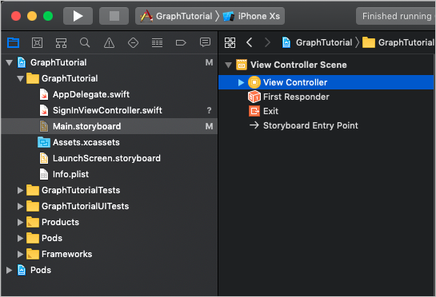
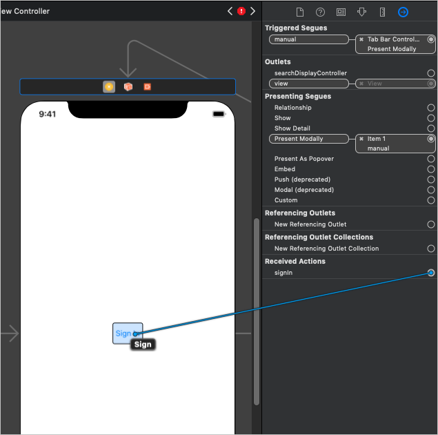
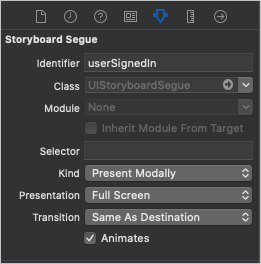
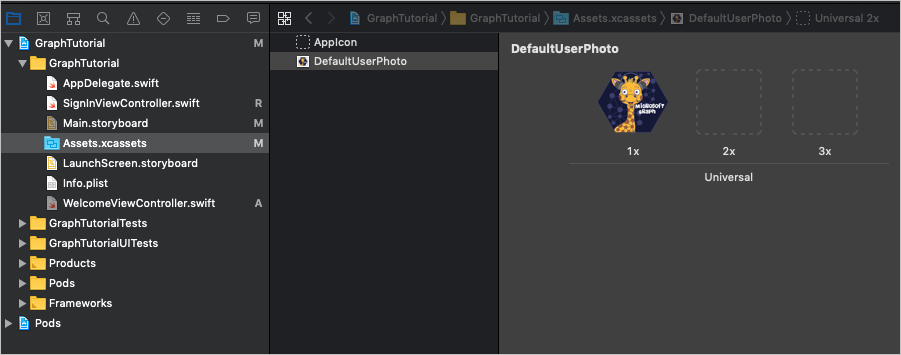

<!-- markdownlint-disable MD002 MD041 -->

<span data-ttu-id="a566c-101">最初に、新しい Swift プロジェクトを作成します。</span><span class="sxs-lookup"><span data-stu-id="a566c-101">Begin by creating a new Swift project.</span></span>

1. <span data-ttu-id="a566c-102">Xcode を開きます。</span><span class="sxs-lookup"><span data-stu-id="a566c-102">Open Xcode.</span></span> <span data-ttu-id="a566c-103">[**ファイル**] メニューの [**新規作成**]、[**プロジェクト**] の順に選択します。</span><span class="sxs-lookup"><span data-stu-id="a566c-103">On the **File** menu, select **New**, then **Project**.</span></span>
1. <span data-ttu-id="a566c-104">[**単一ビューアプリ**] テンプレートを選択し、[**次へ**] を選択します。</span><span class="sxs-lookup"><span data-stu-id="a566c-104">Choose the **Single View App** template and select **Next**.</span></span>

    

1. <span data-ttu-id="a566c-106">**製品名** `GraphTutorial`と**言語**を**Swift**に設定します。</span><span class="sxs-lookup"><span data-stu-id="a566c-106">Set the **Product Name** to `GraphTutorial` and the **Language** to **Swift**.</span></span>
1. <span data-ttu-id="a566c-107">残りのフィールドに入力し、[**次へ**] を選択します。</span><span class="sxs-lookup"><span data-stu-id="a566c-107">Fill in the remaining fields and select **Next**.</span></span>
1. <span data-ttu-id="a566c-108">プロジェクトの場所を選択して、[**作成**] を選択します。</span><span class="sxs-lookup"><span data-stu-id="a566c-108">Choose a location for the project and select **Create**.</span></span>

## <a name="install-dependencies"></a><span data-ttu-id="a566c-109">依存関係のインストール</span><span class="sxs-lookup"><span data-stu-id="a566c-109">Install dependencies</span></span>

<span data-ttu-id="a566c-110">に進む前に、後で使用する追加の依存関係をインストールします。</span><span class="sxs-lookup"><span data-stu-id="a566c-110">Before moving on, install some additional dependencies that you will use later.</span></span>

- <span data-ttu-id="a566c-111">Azure AD での認証については、 [Microsoft Authentication Library (MSAL) For iOS](https://github.com/AzureAD/microsoft-authentication-library-for-objc)を使用してください。</span><span class="sxs-lookup"><span data-stu-id="a566c-111">[Microsoft Authentication Library (MSAL) for iOS](https://github.com/AzureAD/microsoft-authentication-library-for-objc) for authenticating to with Azure AD.</span></span>
- <span data-ttu-id="a566c-112">Microsoft graph に電話をかけるための[Microsoft GRAPH SDK For 客観 C](https://github.com/microsoftgraph/msgraph-sdk-objc) 。</span><span class="sxs-lookup"><span data-stu-id="a566c-112">[Microsoft Graph SDK for Objective C](https://github.com/microsoftgraph/msgraph-sdk-objc) for making calls to Microsoft Graph.</span></span>
- <span data-ttu-id="a566c-113">Microsoft Graph では、ユーザーやイベントなどの Microsoft Graph のリソースを表す、厳密に型指定されたオブジェクト用の[Microsoft Graph モデル SDK を目的](https://github.com/microsoftgraph/msgraph-sdk-objc-models)としています。</span><span class="sxs-lookup"><span data-stu-id="a566c-113">[Microsoft Graph Models SDK for Objective C](https://github.com/microsoftgraph/msgraph-sdk-objc-models) for strongly-typed objects representing Microsoft Graph resources like users or events.</span></span>

1. <span data-ttu-id="a566c-114">Xcode を終了します。</span><span class="sxs-lookup"><span data-stu-id="a566c-114">Quit Xcode.</span></span>
1. <span data-ttu-id="a566c-115">ターミナルを開き、グラフのディレクトリを**Graphtutorial**プロジェクトの場所に変更します。</span><span class="sxs-lookup"><span data-stu-id="a566c-115">Open Terminal and change the directory to the location of your **GraphTutorial** project.</span></span>
1. <span data-ttu-id="a566c-116">Podfile を作成するには、次のコマンドを実行します。</span><span class="sxs-lookup"><span data-stu-id="a566c-116">Run the following command to create a Podfile.</span></span>

    ```Shell
    pod init
    ```

1. <span data-ttu-id="a566c-117">Podfile を開き、行の`use_frameworks!`直後に次の行を追加します。</span><span class="sxs-lookup"><span data-stu-id="a566c-117">Open the Podfile and add the following lines just after the `use_frameworks!` line.</span></span>

    ```Ruby
    pod 'MSAL', '~> 1.0.2'
    pod 'MSGraphClientSDK', ' ~> 1.0.0'
    pod 'MSGraphClientModels', '~> 1.3.0'
    ```

1. <span data-ttu-id="a566c-118">Podfile を保存してから、次のコマンドを実行して依存関係をインストールします。</span><span class="sxs-lookup"><span data-stu-id="a566c-118">Save the Podfile, then run the following command to install the dependencies.</span></span>

    ```Shell
    pod install
    ```

1. <span data-ttu-id="a566c-119">コマンドが完了したら、Xcode で新しく作成した**graphtutorial**を開きます。</span><span class="sxs-lookup"><span data-stu-id="a566c-119">Once the command completes, open the newly created **GraphTutorial.xcworkspace** in Xcode.</span></span>

## <a name="design-the-app"></a><span data-ttu-id="a566c-120">アプリを設計する</span><span class="sxs-lookup"><span data-stu-id="a566c-120">Design the app</span></span>

<span data-ttu-id="a566c-121">このセクションでは、アプリのビュー (サインインページ、タブバーナビゲーター、ウェルカムページ、予定表ページ) を作成します。</span><span class="sxs-lookup"><span data-stu-id="a566c-121">In this section you will create the views for the app: a sign in page, a tab bar navigator, a welcome page, and a calendar page.</span></span> <span data-ttu-id="a566c-122">また、アクティビティインジケーターオーバーレイも作成します。</span><span class="sxs-lookup"><span data-stu-id="a566c-122">You'll also create an activity indicator overlay.</span></span>

### <a name="create-sign-in-page"></a><span data-ttu-id="a566c-123">サインインページの作成</span><span class="sxs-lookup"><span data-stu-id="a566c-123">Create sign in page</span></span>

1. <span data-ttu-id="a566c-124">Xcode の**Graphtutorial**フォルダーを展開し、[ **viewcontroller. swift**] を選択します。</span><span class="sxs-lookup"><span data-stu-id="a566c-124">Expand the **GraphTutorial** folder in Xcode, then select **ViewController.swift**.</span></span>
1. <span data-ttu-id="a566c-125">**ファイルインスペクター**で、ファイルの**名前**をに`SignInViewController.swift`変更します。</span><span class="sxs-lookup"><span data-stu-id="a566c-125">In the **File Inspector**, change the **Name** of the file to `SignInViewController.swift`.</span></span>

    

1. <span data-ttu-id="a566c-127">**SignInViewController**を開き、そのコンテンツを次のコードに置き換えます。</span><span class="sxs-lookup"><span data-stu-id="a566c-127">Open **SignInViewController.swift** and replace its contents with the following code.</span></span>

    ```Swift
    import UIKit

    class SignInViewController: UIViewController {

        override func viewDidLoad() {
            super.viewDidLoad()
            // Do any additional setup after loading the view.
        }

        @IBAction func signIn() {
            self.performSegue(withIdentifier: "userSignedIn", sender: nil)
        }
    }
    ```

1. <span data-ttu-id="a566c-128">メインの**ストーリーボード**ファイルを開きます。</span><span class="sxs-lookup"><span data-stu-id="a566c-128">Open the **Main.storyboard** file.</span></span>
1. <span data-ttu-id="a566c-129">[**ビューコントローラーシーン**] を展開し、[**ビューコントローラー**] を選択します。</span><span class="sxs-lookup"><span data-stu-id="a566c-129">Expand **View Controller Scene**, then select **View Controller**.</span></span>

    

1. <span data-ttu-id="a566c-131">[ **Identity Inspector**] を選択してから、**クラス**のドロップダウンを**SignInViewController**に変更します。</span><span class="sxs-lookup"><span data-stu-id="a566c-131">Select the **Identity Inspector**, then change the **Class** dropdown to **SignInViewController**.</span></span>

    

1. <span data-ttu-id="a566c-133">**ライブラリ**を選択し、**ボタン**を [サインイン]**ビューコントローラー**にドラッグします。</span><span class="sxs-lookup"><span data-stu-id="a566c-133">Select the **Library**, then drag a **Button** onto the **Sign In View Controller**.</span></span>

    

1. <span data-ttu-id="a566c-135">ボタンを選択した状態で、[ **Attributes Inspector** ] \*\*\*\* を選択し、ボタン`Sign In`のタイトルをに変更します。</span><span class="sxs-lookup"><span data-stu-id="a566c-135">With the button selected, select the **Attributes Inspector** and change the **Title** of the button to `Sign In`.</span></span>

    

1. <span data-ttu-id="a566c-137">**サインインビューコントローラー**を選択し、[**接続インスペクター**] を選択します。</span><span class="sxs-lookup"><span data-stu-id="a566c-137">Select the **Sign In View Controller**, then select the **Connections Inspector**.</span></span>
1. <span data-ttu-id="a566c-138">[**受信した処理**] で、[**サインイン**] の隣にある円をボタンにドラッグします。</span><span class="sxs-lookup"><span data-stu-id="a566c-138">Under **Received Actions**, drag the unfilled circle next to **signIn** onto the button.</span></span> <span data-ttu-id="a566c-139">ポップアップメニューで [ **Touch Up** ] を選択します。</span><span class="sxs-lookup"><span data-stu-id="a566c-139">Select **Touch Up Inside** on the pop-up menu.</span></span>

    

1. <span data-ttu-id="a566c-141">[**エディター** ] メニューの [**自動レイアウトの問題を解決**する] を選択し、[すべてのビューの下**にある**[不足している**制約の追加**] を選択します。</span><span class="sxs-lookup"><span data-stu-id="a566c-141">On the **Editor** menu, select **Resolve Auto Layout Issues**, then select **Add Missing Constraints** underneath **All Views in Sign In View Controller**.</span></span>

### <a name="create-tab-bar"></a><span data-ttu-id="a566c-142">タブバーを作成する</span><span class="sxs-lookup"><span data-stu-id="a566c-142">Create tab bar</span></span>

1. <span data-ttu-id="a566c-143">**ライブラリ**を選択し、**タブバーコントローラー**をストーリーボードにドラッグします。</span><span class="sxs-lookup"><span data-stu-id="a566c-143">Select the **Library**, then drag a **Tab Bar Controller** onto the storyboard.</span></span>
1. <span data-ttu-id="a566c-144">**サインインビューコントローラー**を選択し、[**接続インスペクター**] を選択します。</span><span class="sxs-lookup"><span data-stu-id="a566c-144">Select the **Sign In View Controller**, then select the **Connections Inspector**.</span></span>
1. <span data-ttu-id="a566c-145">[**トリガー**された Segues] で、[**手動**] の横にある円を、ストーリーボードの**タブバーコントローラー**にドラッグします。</span><span class="sxs-lookup"><span data-stu-id="a566c-145">Under **Triggered Segues**, drag the unfilled circle next to **manual** onto the **Tab Bar Controller** on the storyboard.</span></span> <span data-ttu-id="a566c-146">ポップアップメニューの [**モーダル**] を選択します。</span><span class="sxs-lookup"><span data-stu-id="a566c-146">Select **Present Modally** in the pop-up menu.</span></span>

    

1. <span data-ttu-id="a566c-148">追加した segue を選択し、[ **Attributes Inspector**] を選択します。</span><span class="sxs-lookup"><span data-stu-id="a566c-148">Select the segue you just added, then select the **Attributes Inspector**.</span></span> <span data-ttu-id="a566c-149">**識別子** `userSignedIn`フィールドをに設定し、**プレゼンテーション**を**全画面表示**に設定します。</span><span class="sxs-lookup"><span data-stu-id="a566c-149">Set the **Identifier** field to `userSignedIn`, and set **Presentation** to **Full Screen**.</span></span>

    

1. <span data-ttu-id="a566c-151">**アイテム1のシーン**を選択し、[**接続インスペクター**] を選択します。</span><span class="sxs-lookup"><span data-stu-id="a566c-151">Select the **Item 1 Scene**, then select the **Connections Inspector**.</span></span>
1. <span data-ttu-id="a566c-152">[**トリガー**された Segues] で、[**手動**] の横にある円を、ストーリーボードの**サインインビューコントローラー**にドラッグします。</span><span class="sxs-lookup"><span data-stu-id="a566c-152">Under **Triggered Segues**, drag the unfilled circle next to **manual** onto the **Sign In View Controller** on the storyboard.</span></span> <span data-ttu-id="a566c-153">ポップアップメニューの [**モーダル**] を選択します。</span><span class="sxs-lookup"><span data-stu-id="a566c-153">Select **Present Modally** in the pop-up menu.</span></span>
1. <span data-ttu-id="a566c-154">追加した segue を選択し、[ **Attributes Inspector**] を選択します。</span><span class="sxs-lookup"><span data-stu-id="a566c-154">Select the segue you just added, then select the **Attributes Inspector**.</span></span> <span data-ttu-id="a566c-155">**識別子** `userSignedOut`フィールドをに設定し、**プレゼンテーション**を**全画面表示**に設定します。</span><span class="sxs-lookup"><span data-stu-id="a566c-155">Set the **Identifier** field to `userSignedOut`, and set **Presentation** to **Full Screen**.</span></span>

### <a name="create-welcome-page"></a><span data-ttu-id="a566c-156">ウェルカムページを作成する</span><span class="sxs-lookup"><span data-stu-id="a566c-156">Create welcome page</span></span>

1. <span data-ttu-id="a566c-157">[ **Assets] セット**ファイルを選択します。</span><span class="sxs-lookup"><span data-stu-id="a566c-157">Select the **Assets.xcassets** file.</span></span>
1. <span data-ttu-id="a566c-158">[**エディター** ] メニューの [**アセットの追加**] を選択し、[**新しいイメージセット**] を選択します。</span><span class="sxs-lookup"><span data-stu-id="a566c-158">On the **Editor** menu, select **Add Assets**, then **New Image Set**.</span></span>
1. <span data-ttu-id="a566c-159">新しい**画像**アセットを選択し、**属性インスペクター**を使用してその**名前**をに`DefaultUserPhoto`設定します。</span><span class="sxs-lookup"><span data-stu-id="a566c-159">Select the new **Image** asset and use the **Attribute Inspector** to set its **Name** to `DefaultUserPhoto`.</span></span>
1. <span data-ttu-id="a566c-160">既定のユーザープロファイル写真として機能する任意のイメージを追加します。</span><span class="sxs-lookup"><span data-stu-id="a566c-160">Add any image you like to serve as a default user profile photo.</span></span>

    

1. <span data-ttu-id="a566c-162">という名前`WelcomeViewController`の**graphtutorial**フォルダーに、新しい**cocoa タッチクラス**ファイルを作成します。</span><span class="sxs-lookup"><span data-stu-id="a566c-162">Create a new **Cocoa Touch Class** file in the **GraphTutorial** folder named `WelcomeViewController`.</span></span> <span data-ttu-id="a566c-163">Field**のサブクラス**で [ **uiviewcontroller** ] を選択します。</span><span class="sxs-lookup"><span data-stu-id="a566c-163">Choose **UIViewController** in the **Subclass of** field.</span></span>
1. <span data-ttu-id="a566c-164">**WelcomeViewController**を開き、そのコンテンツを次のコードに置き換えます。</span><span class="sxs-lookup"><span data-stu-id="a566c-164">Open **WelcomeViewController.swift** and replace its contents with the following code.</span></span>

    ```Swift
    import UIKit

    class WelcomeViewController: UIViewController {

        @IBOutlet var userProfilePhoto: UIImageView!
        @IBOutlet var userDisplayName: UILabel!
        @IBOutlet var userEmail: UILabel!

        override func viewDidLoad() {
            super.viewDidLoad()

            // Do any additional setup after loading the view.

            // TEMPORARY
            self.userProfilePhoto.image = UIImage(imageLiteralResourceName: "DefaultUserPhoto")
            self.userDisplayName.text = "Default User"
            self.userEmail.text = "default@contoso.com"
        }

        @IBAction func signOut() {
            self.performSegue(withIdentifier: "userSignedOut", sender: nil)
        }
    }
    ```

1. <span data-ttu-id="a566c-165">**メインのストーリーボード**を開きます。</span><span class="sxs-lookup"><span data-stu-id="a566c-165">Open **Main.storyboard**.</span></span> <span data-ttu-id="a566c-166">**アイテム1のシーン**を選択し、[ **id インスペクター**] を選択します。</span><span class="sxs-lookup"><span data-stu-id="a566c-166">Select the **Item 1 Scene**, then select the **Identity Inspector**.</span></span> <span data-ttu-id="a566c-167">**クラス**値を**WelcomeViewController**に変更します。</span><span class="sxs-lookup"><span data-stu-id="a566c-167">Change the **Class** value to **WelcomeViewController**.</span></span>
1. <span data-ttu-id="a566c-168">**ライブラリ**を使用して、次のアイテムを**アイテム1のシーン**に追加します。</span><span class="sxs-lookup"><span data-stu-id="a566c-168">Using the **Library**, add the following items to the **Item 1 Scene**.</span></span>

    - <span data-ttu-id="a566c-169">1つの**イメージビュー**</span><span class="sxs-lookup"><span data-stu-id="a566c-169">One **Image View**</span></span>
    - <span data-ttu-id="a566c-170">2つの**ラベル**</span><span class="sxs-lookup"><span data-stu-id="a566c-170">Two **Labels**</span></span>
    - <span data-ttu-id="a566c-171">1つの**ボタン**</span><span class="sxs-lookup"><span data-stu-id="a566c-171">One **Button**</span></span>

1. <span data-ttu-id="a566c-172">イメージビューを選択し、**サイズインスペクター**を選択します。</span><span class="sxs-lookup"><span data-stu-id="a566c-172">Select the image view, then select the **Size Inspector**.</span></span>
1. <span data-ttu-id="a566c-173">**幅**と**高さ**を196に設定します。</span><span class="sxs-lookup"><span data-stu-id="a566c-173">Set the **Width** and **Height** to 196.</span></span>
1. <span data-ttu-id="a566c-174">2番目のラベルを選択し、[ **Attributes インスペクター**] を選択します。</span><span class="sxs-lookup"><span data-stu-id="a566c-174">Select the second label, then select the **Attributes Inspector**.</span></span>
1. <span data-ttu-id="a566c-175">**色**を**濃い灰色の色**に変更し、**フォント**を**システム 12.0**に変更します。</span><span class="sxs-lookup"><span data-stu-id="a566c-175">Change the **Color** to **Dark Gray Color**, and change the **Font** to **System 12.0**.</span></span>
1. <span data-ttu-id="a566c-176">ボタンを選択し、[ **Attributes Inspector**] を選択します。</span><span class="sxs-lookup"><span data-stu-id="a566c-176">Select the button, then select the **Attributes Inspector**.</span></span>
1. <span data-ttu-id="a566c-177">**タイトル**をに`Sign Out`変更します。</span><span class="sxs-lookup"><span data-stu-id="a566c-177">Change the **Title** to `Sign Out`.</span></span>
1. <span data-ttu-id="a566c-178">[**接続インスペクター**] を使用して、次の接続を行います。</span><span class="sxs-lookup"><span data-stu-id="a566c-178">Using the **Connections Inspector**, make the following connections.</span></span>

    - <span data-ttu-id="a566c-179">**Userdisplayname**アウトレットを最初のラベルにリンクします。</span><span class="sxs-lookup"><span data-stu-id="a566c-179">Link the **userDisplayName** outlet to the first label.</span></span>
    - <span data-ttu-id="a566c-180">**Useremail**アウトレットを2番目のラベルにリンクします。</span><span class="sxs-lookup"><span data-stu-id="a566c-180">Link the **userEmail** outlet to the second label.</span></span>
    - <span data-ttu-id="a566c-181">**UserProfilePhoto**アウトレットをイメージビューにリンクします。</span><span class="sxs-lookup"><span data-stu-id="a566c-181">Link the **userProfilePhoto** outlet to the image view.</span></span>
    - <span data-ttu-id="a566c-182">**SignOut** received アクションをボタンの**タッチアップ**にリンクします。</span><span class="sxs-lookup"><span data-stu-id="a566c-182">Link the **signOut** received action to the button's **Touch Up Inside**.</span></span>

1. <span data-ttu-id="a566c-183">シーンの下部にあるタブバー項目を選択し、[ **Attributes Inspector**] を選択します。</span><span class="sxs-lookup"><span data-stu-id="a566c-183">Select the tab bar item at the bottom of the scene, then select the **Attributes Inspector**.</span></span> <span data-ttu-id="a566c-184">**タイトル**をに`Me`変更します。</span><span class="sxs-lookup"><span data-stu-id="a566c-184">Change the **Title** to `Me`.</span></span>
1. <span data-ttu-id="a566c-185">[**エディター** ] メニューの [**自動レイアウトの問題を解決**する] を選択し、[**ウェルカムビューコントローラーのすべてのビューの**下にある [不足している制約を**追加**する] を選択します。</span><span class="sxs-lookup"><span data-stu-id="a566c-185">On the **Editor** menu, select **Resolve Auto Layout Issues**, then select **Add Missing Constraints** underneath **All Views in Welcome View Controller**.</span></span>

<span data-ttu-id="a566c-186">完了したら、開始シーンは次のようになります。</span><span class="sxs-lookup"><span data-stu-id="a566c-186">The welcome scene should look similar to this once you're done.</span></span>


### <a name="create-calendar-page"></a><span data-ttu-id="a566c-188">予定表ページを作成する</span><span class="sxs-lookup"><span data-stu-id="a566c-188">Create calendar page</span></span>

1. <span data-ttu-id="a566c-189">という名前`CalendarViewController`の**graphtutorial**フォルダーに、新しい**cocoa タッチクラス**ファイルを作成します。</span><span class="sxs-lookup"><span data-stu-id="a566c-189">Create a new **Cocoa Touch Class** file in the **GraphTutorial** folder named `CalendarViewController`.</span></span> <span data-ttu-id="a566c-190">Field**のサブクラス**で [ **uiviewcontroller** ] を選択します。</span><span class="sxs-lookup"><span data-stu-id="a566c-190">Choose **UIViewController** in the **Subclass of** field.</span></span>
1. <span data-ttu-id="a566c-191">**Calendarviewcontroller**を開き、その内容を次のコードで置き換えます。</span><span class="sxs-lookup"><span data-stu-id="a566c-191">Open **CalendarViewController.swift** and replace its contents with the following code.</span></span>

    ```Swift
    import UIKit

    class CalendarViewController: UIViewController {

        @IBOutlet var calendarJSON: UITextView!

        override func viewDidLoad() {
            super.viewDidLoad()

            // Do any additional setup after loading the view.

            // TEMPORARY
            calendarJSON.text = "Calendar"
            calendarJSON.sizeToFit()
        }
    }
    ```

1. <span data-ttu-id="a566c-192">**メインのストーリーボード**を開きます。</span><span class="sxs-lookup"><span data-stu-id="a566c-192">Open **Main.storyboard**.</span></span> <span data-ttu-id="a566c-193">**アイテム2のシーン**を選択し、[ **id インスペクター**] を選択します。</span><span class="sxs-lookup"><span data-stu-id="a566c-193">Select the **Item 2 Scene**, then select the **Identity Inspector**.</span></span> <span data-ttu-id="a566c-194">**クラス**値を**calendarviewcontroller**に変更します。</span><span class="sxs-lookup"><span data-stu-id="a566c-194">Change the **Class** value to **CalendarViewController**.</span></span>
1. <span data-ttu-id="a566c-195">**ライブラリ**を使用して、**アイテム2のシーン**に**テキストビュー**を追加します。</span><span class="sxs-lookup"><span data-stu-id="a566c-195">Using the **Library**, add a **Text View** to the **Item 2 Scene**.</span></span>
1. <span data-ttu-id="a566c-196">追加したテキストビューを選択します。</span><span class="sxs-lookup"><span data-stu-id="a566c-196">Select the text view you just added.</span></span> <span data-ttu-id="a566c-197">**エディター**で、[**埋め込み**] を選択してから、[ビュー] を**スクロール**します。</span><span class="sxs-lookup"><span data-stu-id="a566c-197">On the **Editor**, choose **Embed In**, then **Scroll View**.</span></span>
1. <span data-ttu-id="a566c-198">[**接続インスペクター**] を使用して、 **calendarjson**アウトレットをテキストビューに接続します。</span><span class="sxs-lookup"><span data-stu-id="a566c-198">Using the **Connections Inspector**, connect the **calendarJSON** outlet to the text view.</span></span>
1. 1. <span data-ttu-id="a566c-199">シーンの下部にあるタブバー項目を選択し、[ **Attributes Inspector**] を選択します。</span><span class="sxs-lookup"><span data-stu-id="a566c-199">Select the tab bar item at the bottom of the scene, then select the **Attributes Inspector**.</span></span> <span data-ttu-id="a566c-200">**タイトル**をに`Calendar`変更します。</span><span class="sxs-lookup"><span data-stu-id="a566c-200">Change the **Title** to `Calendar`.</span></span>
1. <span data-ttu-id="a566c-201">[**エディター** ] メニューの [**自動レイアウトの問題を解決**する] を選択し、[**ウェルカムビューコントローラーのすべてのビューの**下にある [不足している制約を**追加**する] を選択します。</span><span class="sxs-lookup"><span data-stu-id="a566c-201">On the **Editor** menu, select **Resolve Auto Layout Issues**, then select **Add Missing Constraints** underneath **All Views in Welcome View Controller**.</span></span>

<span data-ttu-id="a566c-202">完了すると、予定表のシーンは次のようになります。</span><span class="sxs-lookup"><span data-stu-id="a566c-202">The calendar scene should look similar to this once you're done.</span></span>


### <a name="create-activity-indicator"></a><span data-ttu-id="a566c-204">アクティビティインジケーターの作成</span><span class="sxs-lookup"><span data-stu-id="a566c-204">Create activity indicator</span></span>

1. <span data-ttu-id="a566c-205">という名前`SpinnerViewController`の**graphtutorial**フォルダーに、新しい**cocoa タッチクラス**ファイルを作成します。</span><span class="sxs-lookup"><span data-stu-id="a566c-205">Create a new **Cocoa Touch Class** file in the **GraphTutorial** folder named `SpinnerViewController`.</span></span> <span data-ttu-id="a566c-206">Field**のサブクラス**で [ **uiviewcontroller** ] を選択します。</span><span class="sxs-lookup"><span data-stu-id="a566c-206">Choose **UIViewController** in the **Subclass of** field.</span></span>
1. <span data-ttu-id="a566c-207">**Spinnerviewcontroller**を開き、その内容を次のコードで置き換えます。</span><span class="sxs-lookup"><span data-stu-id="a566c-207">Open **SpinnerViewController.swift** and replace its contents with the following code.</span></span>

    ```Swift
    import UIKit

    class SpinnerViewController: UIViewController {

        var spinner = UIActivityIndicatorView(style: .whiteLarge)

        override func loadView() {
            view = UIView()
            view.backgroundColor = UIColor(white: 0, alpha: 0.7)

            spinner.translatesAutoresizingMaskIntoConstraints = false
            spinner.startAnimating()
            view.addSubview(spinner)

            spinner.centerXAnchor.constraint(equalTo: view.centerXAnchor).isActive = true
            spinner.centerYAnchor.constraint(equalTo: view.centerYAnchor).isActive = true
        }

        public func start(container: UIViewController) {
            container.addChild(self)
            self.view.frame = container.view.frame
            container.view.addSubview(self.view)
            self.didMove(toParent: container)
        }

        public func stop() {
            self.willMove(toParent: nil)
            self.view.removeFromSuperview()
            self.removeFromParent()
        }
    }
    ```

## <a name="test-the-app"></a><span data-ttu-id="a566c-208">アプリのテスト</span><span class="sxs-lookup"><span data-stu-id="a566c-208">Test the app</span></span>

<span data-ttu-id="a566c-209">変更を保存し、アプリを起動します。</span><span class="sxs-lookup"><span data-stu-id="a566c-209">Save your changes and launch the app.</span></span> <span data-ttu-id="a566c-210">[**サインイン**] ボタンと [**サインアウト**] ボタン、およびタブバーを使用して、画面間を移動できるようにする必要があります。</span><span class="sxs-lookup"><span data-stu-id="a566c-210">You should be able to move between the screens using the **Sign In** and **Sign Out** buttons and the tab bar.</span></span>


