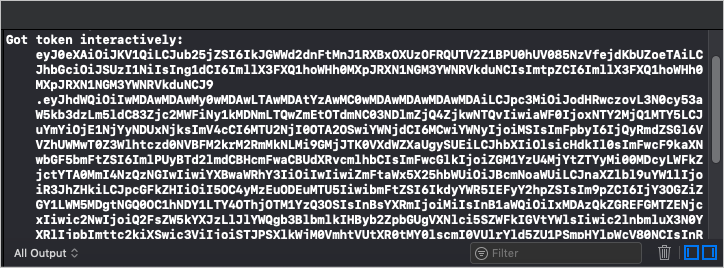

<!-- markdownlint-disable MD002 MD041 -->

この演習では、Azure AD での認証をサポートするために、前の手順で作成したアプリケーションを拡張します。 これは、Microsoft Graph を呼び出すために必要な OAuth アクセストークンを取得するために必要です。 これを行うには、 [iOS 用 Microsoft Authentication Library (MSAL)](https://github.com/AzureAD/microsoft-authentication-library-for-objc)をアプリケーションに統合します。

1. **Authsettings. plist**という名前の**graphtutorial**プロジェクトに、新しい**プロパティリスト**ファイルを作成します。
1. 次の項目を**ルート**ディクショナリのファイルに追加します。

    | キー | 型 | 値 |
    |-----|------|-------|
    | `AppId` | String | Azure portal からのアプリケーション ID |
    | `GraphScopes` | 配列 | 2つの文字列`User.Read`値:`Calendars.Read` |

    

> [!IMPORTANT]
> Git などのソース管理を使用している場合は、アプリ ID が誤ってリークしないように、ソース管理から**Authsettings の設定**ファイルを除外することをお勧めします。

## <a name="implement-sign-in"></a>サインインの実装

このセクションでは、MSAL のプロジェクトを構成し、認証マネージャークラスを作成し、サインインしてサインアウトするためにアプリを更新します。

### <a name="configure-project-for-msal"></a>MSAL のプロジェクトを構成する

1. プロジェクトの機能に新しいキーチェーングループを追加します。
    1. **Graphtutorial**プロジェクトを選択し、 **& 機能に署名**します。
    1. [ **+ 機能**] を選択し、[**キーチェーン共有**] をダブルクリックします。
    1. 値`com.microsoft.adalcache`を持つキーチェーングループを追加します。

1. [コントロール] をクリックし、[**名前を付けて開く**]、[**ソースコード**] の順に選択し**ます。**
1. `<dict>`要素内に次のように追加します。

    ```xml
    <key>CFBundleURLTypes</key>
    <array>
      <dict>
        <key>CFBundleURLSchemes</key>
        <array>
          <string>msauth.$(PRODUCT_BUNDLE_IDENTIFIER)</string>
        </array>
      </dict>
    </array>
    <key>LSApplicationQueriesSchemes</key>
    <array>
        <string>msauthv2</string>
        <string>msauthv3</string>
    </array>
    ```

1. **Appdelegate**を開き、ファイルの先頭に次の import ステートメントを追加します。

    ```Swift
    import MSAL
    ```

1. 次の関数を `AppDelegate` クラスに追加します。

    :::code language="swift" source="../demo/GraphTutorial/GraphTutorial/AppDelegate.swift" id="HandleMsalResponseSnippet":::

### <a name="create-authentication-manager"></a>認証マネージャーを作成する

1. 「 **Authenticationmanager. Swift**」という名前の**graphtutorial**プロジェクトに新しい**Swift ファイル**を作成します。 このファイルに次のコードを追加します。

    :::code language="swift" source="../demo/GraphTutorial/GraphTutorial/AuthenticationManager.swift" id="AuthManagerSnippet":::

### <a name="add-sign-in-and-sign-out"></a>サインインとサインアウトを追加する

1. **SignInViewController**を開き、そのコンテンツを次のコードに置き換えます。

    :::code language="swift" source="../demo/GraphTutorial/GraphTutorial/SignInViewController.swift" id="SignInViewSnippet":::

1. **WelcomeViewController**を開き、既存`signOut`の関数を次のように置き換えます。

    :::code language="swift" source="../demo/GraphTutorial/GraphTutorial/WelcomeViewController.swift" id="SignOutSnippet":::

1. 変更を保存し、シミュレータでアプリケーションを再起動します。

アプリにサインインすると、Xcode の [出力] ウィンドウにアクセストークンが表示されます。



## <a name="get-user-details"></a>ユーザーの詳細情報を取得する

このセクションでは、Microsoft Graph へのすべての呼び出しを保持するヘルパークラスを作成し、 `WelcomeViewController`を更新して、この新しいクラスを使用してログインしているユーザーを取得します。

1. 「 **Graphtutorial. Swift**」という名前の**graphtutorial**プロジェクトに新しい**Swift ファイル**を作成します。 このファイルに次のコードを追加します。

    ```Swift
    import Foundation
    import MSGraphClientSDK
    import MSGraphClientModels

    class GraphManager {

        // Implement singleton pattern
        static let instance = GraphManager()

        private let client: MSHTTPClient?

        private init() {
            client = MSClientFactory.createHTTPClient(with: AuthenticationManager.instance)
        }

        public func getMe(completion: @escaping(MSGraphUser?, Error?) -> Void) {
            // GET /me
            let meRequest = NSMutableURLRequest(url: URL(string: "\(MSGraphBaseURL)/me")!)
            let meDataTask = MSURLSessionDataTask(request: meRequest, client: self.client, completion: {
                (data: Data?, response: URLResponse?, graphError: Error?) in
                guard let meData = data, graphError == nil else {
                    completion(nil, graphError)
                    return
                }

                do {
                    // Deserialize response as a user
                    let user = try MSGraphUser(data: meData)
                    completion(user, nil)
                } catch {
                    completion(nil, error)
                }
            })

            // Execute the request
            meDataTask?.execute()
        }
    }
    ```

1. **WelcomeViewController**を開き、次`import`のステートメントをファイルの先頭に追加します。

    ```Swift
    import MSGraphClientModels
    ```

1. 次のプロパティを `WelcomeViewController` クラスに追加します。

    ```Swift
    private let spinner = SpinnerViewController()
    ```

1. 既存`viewDidLoad`のを次のコードに置き換えます。

    :::code language="swift" source="../demo/GraphTutorial/GraphTutorial/WelcomeViewController.swift" id="ViewDidLoadSnippet":::

変更を保存して今すぐアプリを再起動すると、サインイン後にユーザーの表示名と電子メールアドレスで UI が更新されます。
