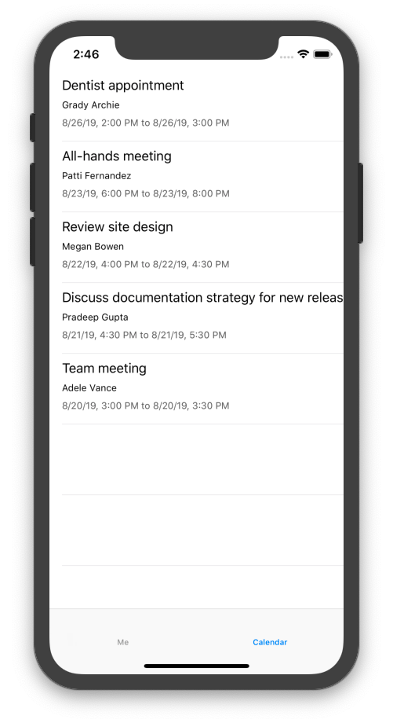

<!-- markdownlint-disable MD002 MD041 -->

この演習では、Microsoft Graph をアプリケーションに組み込みます。 このアプリケーションでは、microsoft graph [SDK for Use C](https://github.com/microsoftgraph/msgraph-sdk-objc)を使用して microsoft graph を呼び出すことにします。

## <a name="get-calendar-events-from-outlook"></a>Outlook からカレンダー イベントを取得する

このセクションでは、 `GraphManager`クラスを拡張して、ユーザーのイベントを取得する関数を追加`CalendarViewController`し、これらの新しい関数を使用するように更新します。

1. **Graphmanager**を開き、次のメソッドを`GraphManager`クラスに追加します。

    ```Swift
    public func getEvents(completion: @escaping(Data?, Error?) -> Void) {
        // GET /me/events?$select='subject,organizer,start,end'$orderby=createdDateTime DESC
        // Only return these fields in results
        let select = "$select=subject,organizer,start,end"
        // Sort results by when they were created, newest first
        let orderBy = "$orderby=createdDateTime+DESC"
        let eventsRequest = NSMutableURLRequest(url: URL(string: "\(MSGraphBaseURL)/me/events?\(select)&\(orderBy)")!)
        let eventsDataTask = MSURLSessionDataTask(request: eventsRequest, client: self.client, completion: {
            (data: Data?, response: URLResponse?, graphError: Error?) in
            guard let eventsData = data, graphError == nil else {
                completion(nil, graphError)
                return
            }

            // TEMPORARY
            completion(eventsData, nil)
        })

        // Execute the request
        eventsDataTask?.execute()
    }
    ```

    > [!NOTE]
    > のコードに`getEvents`ついて検討します。
    >
    > - 呼び出される URL は `/v1.0/me/events` です。
    > - Query `select`パラメーターは、各イベントに対して返されるフィールドを、アプリが実際に使用するものだけに制限します。
    > - クエリ`orderby`パラメーターは、生成された日付と時刻で結果を並べ替えます。最新のアイテムが最初に表示されます。

1. **Calendarviewcontroller**を開き、その内容全体を次のコードで置き換えます。

    ```Swift
    import UIKit
    import MSGraphClientModels

    class CalendarViewController: UIViewController {

        @IBOutlet var calendarJSON: UITextView!

        private let spinner = SpinnerViewController()

        override func viewDidLoad() {
            super.viewDidLoad()

            // Do any additional setup after loading the view.
            self.spinner.start(container: self)

            GraphManager.instance.getEvents {
                (data: Data?, error: Error?) in
                DispatchQueue.main.async {
                    self.spinner.stop()

                    guard let eventsData = data, error == nil else {
                        self.calendarJSON.text = error.debugDescription
                        return
                    }

                    let jsonString = String(data: eventsData, encoding: .utf8)
                    self.calendarJSON.text = jsonString
                    self.calendarJSON.sizeToFit()
                }
            }
        }
    }
    ```

これで、アプリを実行し、サインインすると、メニューの [**予定表**] ナビゲーション項目をタップできるようになります。 アプリ内のイベントの JSON ダンプが表示されます。

## <a name="display-the-results"></a>結果の表示

これで、JSON ダンプを、ユーザーにわかりやすい方法で結果を表示するためのものに置き換えることができます。 このセクションでは、厳密に型`getEvents`指定されたオブジェクトを返すように関数`CalendarViewController`を変更し、テーブルビューを使用してイベントをレンダリングするように変更します。

1. **Graphmanager を**開きます。 既存の `getEvents` 関数を、以下の関数で置き換えます。

    :::code language="swift" source="../demo/GraphTutorial/GraphTutorial/GraphManager.swift" id="GetEventsSnippet" highlight="1,17-38":::

1. という名前`CalendarTableViewCell.swift`の**graphtutorial**プロジェクトに、新しい**cocoa タッチクラス**ファイルを作成します。 Field**のサブクラス**で [ **Uitableviewcell セル**を選択します。

1. **Calendartableviewcell**を開き、次のコードを`CalendarTableViewCell`クラスに追加します。

    :::code language="swift" source="../demo/GraphTutorial/GraphTutorial/CalendarTableViewCell.swift" id="PropertiesSnippet":::

1. **メインのストーリーボード**を開いて、**予定表のシーン**を探します。 **予定表のシーン**で**ビュー**を選択し、削除します。

    

1. **ライブラリ**から予定表の**シーン**に**テーブルビュー**を追加します。
1. テーブルビューを選択し、[**属性インスペクター**] を選択します。 **プロトタイプセル**を**1**に設定します。
1. **ライブラリ**を使用して、[プロトタイプ] セルに3つの**ラベル**を追加します。
1. [プロトタイプ] セルを選択し、[ **Identity Inspector**] を選択します。 **クラス**を**Calendartableviewcell**に変更します。
1. [ **Attributes インスペクター** ] を選択し、 `EventCell`**識別子**をに設定します。
1. [ **Eventcell セル**を選択した状態で、[ `durationLabel`**接続インスペクター** ] `subjectLabel` 、[接続] `organizerLabel`、[] の順に選択し、ストーリーボードのセルに追加したラベルに接続します。
1. 3つのラベルのプロパティと制約を次のように設定します。

    - **件名ラベル**
        - 制約の追加: 先頭の領域をコンテンツビューの先頭余白、値: 0 にします。
        - 制約の追加: 末尾のスペースをコンテンツビューの末尾の余白、値: 0 にします。
        - 制約の追加: 上スペースからコンテンツビューの上余白、値: 0
    - **開催者のラベル**
        - フォント: システム12.0
        - 制約の追加: 先頭の領域をコンテンツビューの先頭余白、値: 0 にします。
        - 制約の追加: 末尾のスペースをコンテンツビューの末尾の余白、値: 0 にします。
        - 制約の追加: 上スペースを件名ラベルの下に、値: Standard にします。
    - **期間のラベル**
        - フォント: システム12.0
        - 色: 濃い灰色
        - 制約の追加: 先頭の領域をコンテンツビューの先頭余白、値: 0 にします。
        - 制約の追加: 末尾のスペースをコンテンツビューの末尾の余白、値: 0 にします。
        - 制約の追加: 上のスペースから開催者ラベルの下、値: 標準
        - 制約の追加: 下のスペースをコンテンツビューの下の余白、値: 8 に制限します。

    

1. **Calendarviewcontroller**を開き、その内容を次のコードで置き換えます。

    :::code language="swift" source="../demo/GraphTutorial/GraphTutorial/CalendarViewController.swift" id="CalendarViewSnippet":::

1. アプリを実行し、サインインして [**予定表**] タブをタップします。イベントの一覧が表示されます。

    
